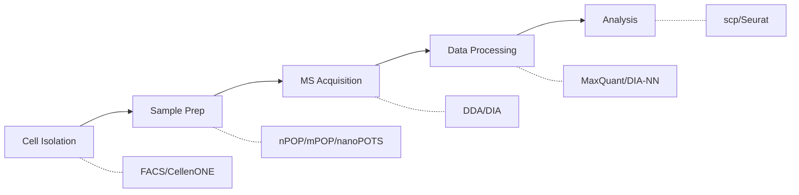

# Single-Cell Proteomics Knowledge Base

Welcome to the Single-Cell Proteomics (SCP) knowledge base. This vault contains comprehensive resources for understanding and implementing MS-based single-cell proteomics.

> [!tip] Quick Start
> Open the [[canvas/SCP Overview.canvas|SCP Overview Canvas]] for a visual map of the field.

---

## Visual Knowledge Maps

| Canvas | Description |
|--------|-------------|
| ![[canvas/SCP Overview.canvas\|SCP Overview]] | High-level field overview with all topics |
| ![[canvas/Methods Workflow.canvas\|Methods Workflow]] | Step-by-step from sample to data |
| ![[canvas/Tools and Software.canvas\|Tools & Software]] | Analysis pipeline and software |

---

## Methods

### Isobaric Labeling (TMT)

| Method | Description | Throughput |
|--------|-------------|------------|
| [[SCoPE2]] | TMT-based SCP with carrier channel | ~200 cells/day |
| [[pSCoPE]] | Targeted/prioritized acquisition | Focused |

### Multiplexed DIA

| Method | Description | Throughput |
|--------|-------------|------------|
| [[plexDIA]] | Non-isobaric labels + DIA | 3x multiplier |

### Sample Preparation

| Method | Platform | Volume |
|--------|----------|--------|
| [[nPOP]] | CellenONE slides | 8-20 nL |
| [[nanoPOTS]] | Microfluidic chips | nL |
| [[mPOP]] | PCR tubes | µL |

---

## Software & Tools

### Data Processing

| Tool | Use Case | Platform |
|------|----------|----------|
| [[MaxQuant]] | TMT/DDA data | Windows |
| [[DIA-NN]] | DIA/plexDIA data | Cross-platform |

### Quality Control

| Tool | Description |
|------|-------------|
| [[DO-MS]] | Interactive QC dashboards |

### Analysis

| Tool | Description |
|------|-------------|
| [[scp Package]] | R/Bioconductor framework |

---

## Databases

| Database | Content | Access |
|----------|---------|--------|
| [[SPDB]] | 143 datasets, 300M+ cells | [scproteomicsdb.com](https://scproteomicsdb.com/) |
| [[SingPro]] | Raw data + detailed protocols | NAR 2024 |

---

## Applications

| Area | Key Topics |
|------|------------|
| [[Cancer Applications]] | Tumor heterogeneity, drug resistance, immune microenvironment |
| [[Cell Differentiation]] | Lineage decisions, protein-RNA discordance |

---

## Vault Resources

### Dynamic Views

- [[Project Overview.base]] - Query all notes by category, connections, and updates

### Templates

Create new notes using [Templater](https://github.com/SilentVoid13/Templater):

| Template | Use For |
|----------|---------|
| [[templates/Method Template\|Method Template]] | New experimental methods |
| [[templates/Tool Template\|Tool Template]] | Software tools |
| [[templates/Database Template\|Database Template]] | Data resources |
| [[templates/Application Template\|Application Template]] | Research applications |
| [[templates/Literature Note\|Literature Note]] | Paper annotations |
| [[templates/Quick Note\|Quick Note]] | Simple notes |

---

## Typical SCP Workflow

| Step | Methods | Tools |
|------|---------|-------|
| 1. Cell Isolation | FACS, CellenONE | - |
| 2. Sample Prep | [[nPOP]], [[mPOP]], [[nanoPOTS]] | - |
| 3. Labeling | TMT, mTRAQ, Label-free | - |
| 4. MS Acquisition | DDA, DIA | timsTOF, Orbitrap |
| 5. Processing | - | [[MaxQuant]], [[DIA-NN]] |
| 6. QC | - | [[DO-MS]] |
| 7. Analysis | - | [[scp Package]] |

---

## External Resources

| Resource | URL |
|----------|-----|
| Slavov Lab | https://scp.slavovlab.net/ |
| Protocols | https://scp.slavovlab.net/protocols |
| scp Bioconductor | https://bioconductor.org/packages/scp/ |
| scp Workshop | https://github.com/lgatto/2024_scpworkshop_EUBIC |
| DO-MS | https://do-ms.slavovlab.net/ |
| DIA-NN | https://github.com/vdemichev/DiaNN |
| SPDB | https://scproteomicsdb.com/ |

---

## Tags Index

| Tag | Content |
|-----|---------|
| #methods | Experimental methods |
| #tools | Software & analysis tools |
| #database | Data resources |
| #applications | Research applications |
| #TMT | Isobaric labeling workflows |
| #DIA | Data-independent acquisition |
| #sample-prep | Sample preparation methods |

---

## Quick Links

- [[README]] - GitHub awesome-list
- [[CLAUDE.md]] - Project documentation
- [[Project Overview.base]] - Dynamic vault overview

---

*Last updated: 2026-01-16*
